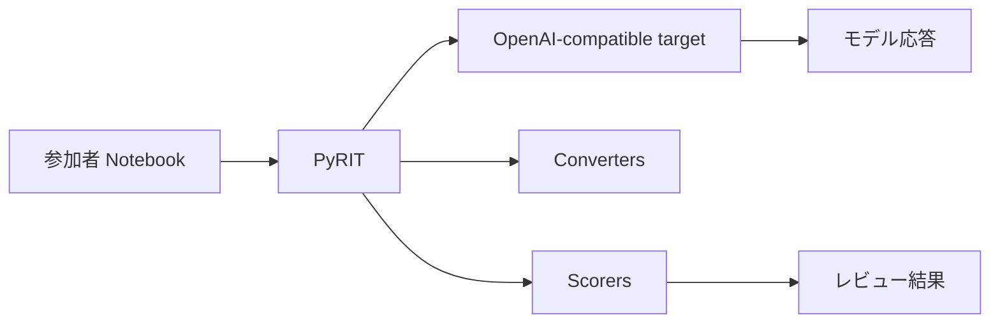

# PyRIT Red Teaming Hands-on

このハンズオンでは、PyRIT を使って生成 AI アプリケーションの安全性を確認する基本的な流れを体験します。

!!! important "この教材の前提"
    参加者は Azure アカウントを使いません。講師が一時的な OpenAI 互換エンドポイント、API キー、モデル名またはデプロイ名を配布します。

## まず始める

環境準備から進める場合は Setup を開いてください。Codespaces で進める場合は、Setup 内のボタンからすぐに開始できます。

[Setup を開く](begin-here/00-setup.md){ .md-button .md-button--primary }
[Labs を見る](labs/index.md){ .md-button }

## このハンズオンで学ぶこと

- AI Red Teaming が何を確認する活動なのか
- PyRIT の Target、Converter、Attack、Scorer の役割
- 安全な架空シナリオでのプロンプト注入テスト
- 結果を自動判定だけでなく人間がレビューする理由

## 全体像

## 進め方

1. `Begin Here` で環境を準備します。
2. Lab 0 でモデルエンドポイントへの接続を確認します。
3. Lab 1 で PyRIT の基本構成を触ります。
4. Lab 2 で安全なプロンプト注入シナリオを試します。
5. Lab 3 で結果をレビューします。

## 扱わないこと

- 参加者による Azure リソース作成
- Azure Portal での確認
- 本番環境や実在サービスへの攻撃
- 実害のある内容を引き出すテスト
